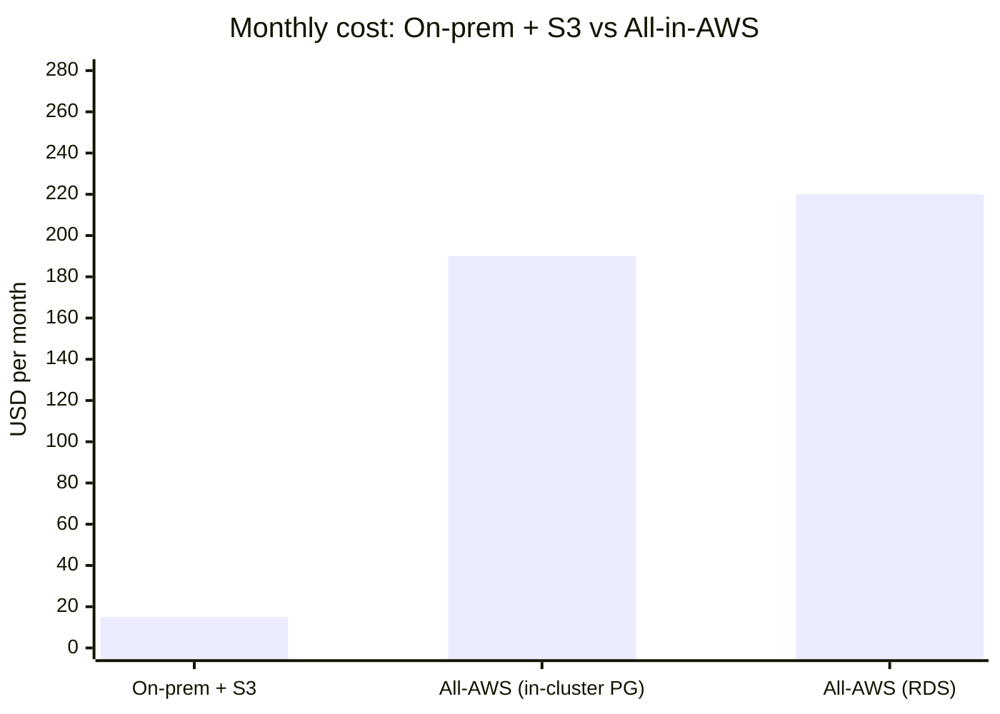
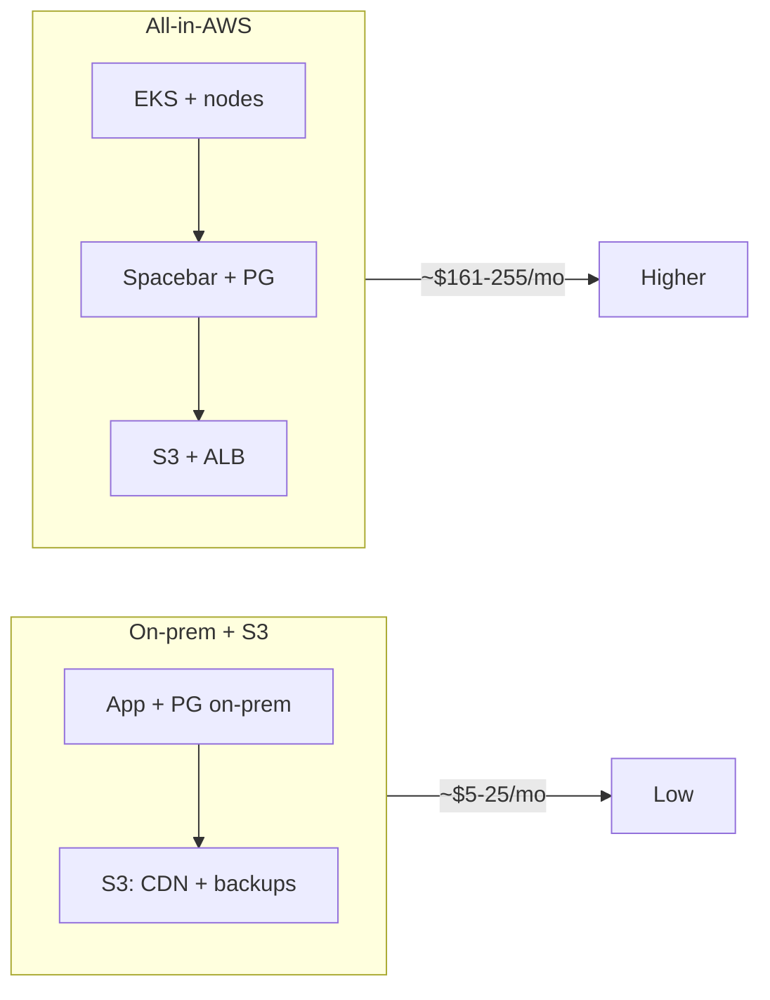

# Spacebar: On-Prem + S3 vs All-in-AWS Cost Comparison

Rough monthly cost comparison (USD, list pricing). Adjust for your region and usage.

---

## Summary

| Scenario | Est. monthly total | Main AWS components |
|----------|--------------------|----------------------|
| **On-prem + S3** | **~$5–25** | S3 only (CDN + Postgres backups) |
| **All-in-AWS (EKS)** | **~$161–255** | EKS, EC2 nodes, S3, ALB; Postgres = RDS or in-cluster |

---

## Line-item comparison

| Cost component | On-prem + S3 | All-in-AWS (EKS) |
|----------------|--------------|------------------|
| **Compute (app + Postgres)** | $0 (on-prem) | EKS nodes (e.g. 2× t3.medium) ~$60–70 |
| **EKS control plane** | $0 | ~$73 |
| **Postgres (if RDS)** | $0 | ~$20–35 (db.t3.micro/small) |
| **Postgres (if in-cluster)** | $0 | ~$1–2 (EBS on nodes) |
| **S3 – CDN** | ~$0.75–4 (storage + requests) | ~$2–5 |
| **S3 – backups** | ~$0.75–4 | $0 (or add ~$1–3 if using S3 backups) |
| **Load balancer** | $0 (on-prem LB) | ALB ~$20–25 (if used) |
| **Data transfer** | ~$0–15 (S3 egress) | ~$5–50+ (egress/traffic) |
| **Total** | **~$5–25** | **~$161–255** (RDS) / **~$161–222** (in-cluster) |

---

## Visual comparison (monthly USD, approximate)

**Bar chart** (if your viewer supports Mermaid `xychart-beta`):

**Scenario overview**:

---

## Notes

- **On-prem + S3**: App and Postgres run on your hardware; only S3 is in AWS (CDN bucket + backup bucket). Backups can be CNPG/Barman to S3.
- **All-AWS**: Full EKS stack (control plane + nodes), Spacebar on EKS, Postgres either RDS or CloudNative-PG on EKS, S3 for CDN, optional ALB.
- Ranges reflect small/medium usage; data transfer and node count have the largest impact on the All-AWS total.
