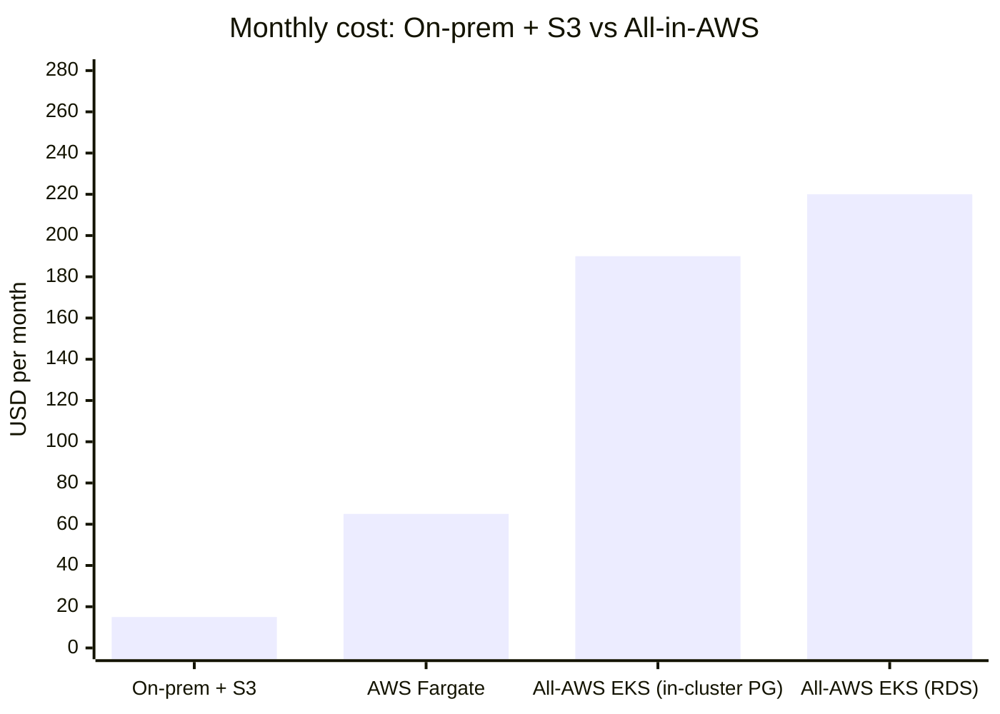
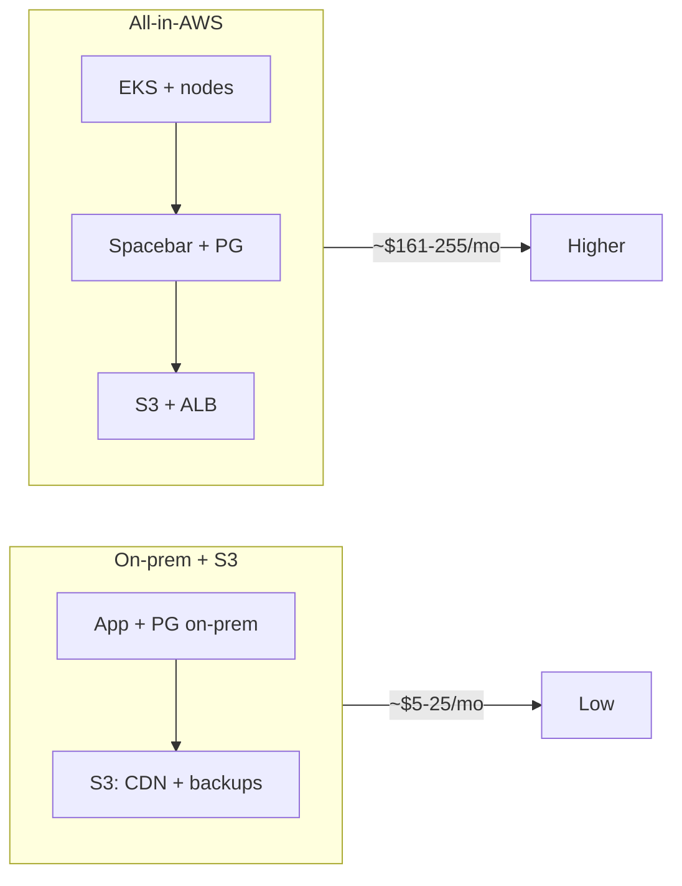

# Spacebar: On-Prem + S3 vs All-in-AWS Cost Comparison

Rough monthly cost comparison (USD, list pricing). Adjust for your region and usage.

---

## Summary

| Scenario | Est. monthly total | Main AWS components |
|----------|--------------------|----------------------|
| **On-prem + S3** | **~$5–25** | S3 only (CDN + Postgres backups) |
| **All-in-AWS (EKS)** | **~$161–255** | EKS, EC2 nodes, S3, ALB; Postgres = RDS or in-cluster |
| **All-in-AWS (serverless containers)** | **~$51–85** | ECS Fargate, ALB, RDS (or Aurora Serverless), S3 |

---

## Line-item comparison

| Cost component | On-prem + S3 | All-in-AWS (EKS) |
|----------------|--------------|------------------|
| **Compute (app + Postgres)** | $0 (on-prem) | EKS nodes (e.g. 2× t3.medium) ~$60–70 |
| **EKS control plane** | $0 | ~$73 |
| **Postgres (if RDS)** | $0 | ~$20–35 (db.t3.micro/small) |
| **Postgres (if in-cluster)** | $0 | ~$1–2 (EBS on nodes) |
| **S3 – CDN** | ~$0.75–4 (storage + requests) | ~$2–5 |
| **S3 – backups** | ~$0.75–4 | $0 (or add ~$1–3 if using S3 backups) |
| **Load balancer** | $0 (on-prem LB) | ALB ~$20–25 (if used) |
| **Data transfer** | ~$0–15 (S3 egress) | ~$5–50+ (egress/traffic) |
| **Total** | **~$5–25** | **~$161–255** (RDS) / **~$161–222** (in-cluster) |

---

## Serverless containers (ECS Fargate): often cheaper than EKS

For a **small**, steady-state deployment, running Spacebar as a **serverless container** (e.g. **ECS Fargate**) is usually **cheaper than EKS** because you avoid the EKS control plane (~$73/mo) and can size a single Fargate task to your actual need.

| Cost component | EKS (current) | ECS Fargate (serverless containers) |
|----------------|----------------|-------------------------------------|
| **Control plane** | ~$73 (EKS) | $0 |
| **Compute (Spacebar)** | EC2 nodes ~$60–70 (e.g. 2× t3.medium) | Fargate task ~$9–20 (e.g. 0.25–0.5 vCPU, 0.5–1 GB, 24/7) |
| **Postgres** | RDS ~$20–35 or in-cluster ~$1–2 | RDS ~$20–35 or Aurora Serverless v2 |
| **Load balancer** | ALB ~$20–25 | ALB ~$20–25 |
| **S3** | ~$2–5 | ~$2–5 |
| **Total** | **~$161–255** | **~$51–85** |

**Fargate rough math (us-east-1, Linux):** ~$0.04048/vCPU/hr + ~$0.004445/GB/hr. One small task (0.25 vCPU, 0.5 GB) 24/7 ≈ **~$9/mo**; (0.5 vCPU, 1 GB) ≈ **~$18/mo**.

**Caveats:**

- **Lambda is not a good fit** for Spacebar’s **Gateway** (WebSockets, long-lived connections). Lambda is request-scoped and has timeout limits; the Gateway expects persistent connections. Use **Fargate** (or App Runner) to run the Spacebar container 24/7, not Lambda for the main app.
- You give up Kubernetes (no Helm chart as-is, no CNPG in-cluster). You’d run the Spacebar image on ECS, use **RDS** (or Aurora Serverless) for Postgres, and S3 for CDN/backups. No in-cluster Postgres unless you run a second Fargate task for Postgres (not typical; RDS is simpler).
- This repo’s **Helm chart and Terraform example target EKS**. A Fargate-based setup would be a separate stack (ECS task definition, ALB, RDS, S3). The same S3 bucket and RDS can be used; only the compute layer changes.

**When serverless containers are cheaper:** Small, low-traffic Spacebar instance where a single Fargate task is enough and you’re fine with RDS (no Kubernetes). **When EKS can still make sense:** You want Kubernetes, multi-service in one cluster, or in-cluster Postgres (CNPG) and are okay with the ~$73/mo control plane.

---

## Visual comparison (monthly USD, approximate)

**Bar chart** (if your viewer supports Mermaid `xychart-beta`):

**Scenario overview**:

---

## Notes

- **On-prem + S3**: App and Postgres run on your hardware; only S3 is in AWS (CDN bucket + backup bucket). Backups can be CNPG/Barman to S3.
- **All-AWS (EKS)**: Full EKS stack (control plane + nodes), Spacebar on EKS, Postgres either RDS or CloudNative-PG on EKS, S3 for CDN, optional ALB.
- **All-AWS (serverless)**: ECS Fargate (or similar) runs the Spacebar container; RDS for Postgres; ALB + S3. No EKS; typically **cheaper for a small deployment**.
- Ranges reflect small/medium usage; data transfer and node count have the largest impact on the All-AWS total.
